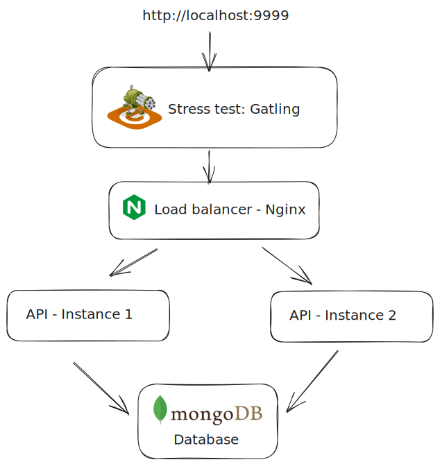

# Rinha de Backend Q3 2023 - Alberto Pluecker

## Tech used:

- Go 1.21
- [Fiber](https://github.com/gofiber/fiber) router
- [MongoDB](https://www.mongodb.com/) noSQL database
- [air](https://github.com/cosmtrek/air) for live reloading
- [Docker](https://www.docker.com/) and [docker-compose](https://docs.docker.com/compose/) (WIP)
- [Swagger](https://swagger.io/) for Docs generation
- [Nginx](https://nginx.org/en/) for load balancing of the stress test
- [Gatling](https://gatling.io/) stress test

Built for the friendly competition [Rinha de Backend Q3 2023](https://github.com/zanfranceschi/rinha-de-backend-2023-q3) by [zanfranceschi](https://github.com/zanfranceschi), competition details (in portuguese) found [here](https://github.com/albertofp/rinha-de-backend/blob/main/INSTRUCOES.md)



## Usage

1. Clone the repo & cd into it

```bash
   git clone git@github.com:albertofp/rinha-de-backend.git && cd rinha-de-backend
```

2. Start the containers

```bash
  docker compose up
```

API exposed at:

```bash
localhost:9999/
```

Docs at

```bash
localhost:9999/docs
```

To run the stress test, run `make stress`

Docs auto-generated by Swagger

## Information

### Version

1.0

### License

[MIT](https://mit-license.org/)

### Contact

Alberto F. Pluecker
albertopluecker@gmail.com
[Github](https://github.com/albertofp)

### Terms Of Service

http://swagger.io/terms/

### URI Schemes

- http

### Consumes

- application/json

### Produces

- application/json

## All endpoints

### count

| Method | URI               | Name                                          | Summary                                      |
| ------ | ----------------- | --------------------------------------------- | -------------------------------------------- |
| GET    | /contagem-pessoas | [get contagem pessoas](#get-contagem-pessoas) | Count total amount of people in the database |

### getall

| Method | URI     | Name                      | Summary                          |
| ------ | ------- | ------------------------- | -------------------------------- |
| GET    | /getall | [get getall](#get-getall) | Get every person in the database |

### pessoas

| Method | URI           | Name                              | Summary                    |
| ------ | ------------- | --------------------------------- | -------------------------- |
| GET    | /pessoas      | [get pessoas](#get-pessoas)       | Search by term             |
| GET    | /pessoas/{id} | [get pessoas ID](#get-pessoas-id) | Search person by ID        |
| POST   | /pessoas      | [post pessoas](#post-pessoas)     | Create new person document |

### status

| Method | URI     | Name                      | Summary      |
| ------ | ------- | ------------------------- | ------------ |
| GET    | /status | [get status](#get-status) | Health check |

## Paths

### <span id="get-contagem-pessoas"></span> Count total amount of people in the database (_GetContagemPessoas_)

```

GET /contagem-pessoas

```

#### Produces

- application/json

#### All responses

| Code                             | Status                | Description           | Has headers | Schema                                     |
| -------------------------------- | --------------------- | --------------------- | :---------: | ------------------------------------------ |
| [200](#get-contagem-pessoas-200) | OK                    | OK                    |             | [schema](#get-contagem-pessoas-200-schema) |
| [500](#get-contagem-pessoas-500) | Internal Server Error | Internal Server Error |             | [schema](#get-contagem-pessoas-500-schema) |

#### Responses

##### <span id="get-contagem-pessoas-200"></span> 200 - OK

Status: OK

###### <span id="get-contagem-pessoas-200-schema"></span> Schema

[ModelsCountResponse](#models-count-response)

##### <span id="get-contagem-pessoas-500"></span> 500 - Internal Server Error

Status: Internal Server Error

###### <span id="get-contagem-pessoas-500-schema"></span> Schema

[ModelsErrorResponse](#models-error-response)

### <span id="get-getall"></span> Get every person in the database (_GetGetall_)

```

GET /getall

```

Returns an empty array if no people found.

#### Produces

- application/json

#### All responses

| Code                   | Status | Description | Has headers | Schema                           |
| ---------------------- | ------ | ----------- | :---------: | -------------------------------- |
| [200](#get-getall-200) | OK     | OK          |             | [schema](#get-getall-200-schema) |

#### Responses

##### <span id="get-getall-200"></span> 200 - OK

Status: OK

###### <span id="get-getall-200-schema"></span> Schema

[][ModelsPersonDTO](#models-person-d-t-o)

### <span id="get-pessoas"></span> Search by term (_GetPessoas_)

```

GET /pessoas

```

Search for a person in database by a given query string. Search term must not be empty

#### Produces

- application/json

#### Parameters

| Name | Source  | Type   | Go type  | Separator | Required | Default | Description |
| ---- | ------- | ------ | -------- | --------- | :------: | ------- | ----------- |
| t    | `query` | string | `string` |           |          |         | Search term |

#### All responses

| Code                    | Status                | Description           | Has headers | Schema                            |
| ----------------------- | --------------------- | --------------------- | :---------: | --------------------------------- |
| [200](#get-pessoas-200) | OK                    | OK                    |             | [schema](#get-pessoas-200-schema) |
| [400](#get-pessoas-400) | Bad Request           | Bad Request           |             | [schema](#get-pessoas-400-schema) |
| [500](#get-pessoas-500) | Internal Server Error | Internal Server Error |             | [schema](#get-pessoas-500-schema) |

#### Responses

##### <span id="get-pessoas-200"></span> 200 - OK

Status: OK

###### <span id="get-pessoas-200-schema"></span> Schema

[][ModelsPersonDTO](#models-person-d-t-o)

##### <span id="get-pessoas-400"></span> 400 - Bad Request

Status: Bad Request

###### <span id="get-pessoas-400-schema"></span> Schema

[ModelsErrorResponse](#models-error-response)

##### <span id="get-pessoas-500"></span> 500 - Internal Server Error

Status: Internal Server Error

###### <span id="get-pessoas-500-schema"></span> Schema

[ModelsErrorResponse](#models-error-response)

### <span id="get-pessoas-id"></span> Search person by ID (_GetPessoasID_)

```

GET /pessoas/{id}

```

Returns a person with the given id (UUID format)

#### Produces

- application/json

#### Parameters

| Name | Source | Type   | Go type  | Separator | Required | Default | Description |
| ---- | ------ | ------ | -------- | --------- | :------: | ------- | ----------- |
| id   | `path` | string | `string` |           |    ✓     |         | Person ID   |

#### All responses

| Code                       | Status                | Description           | Has headers | Schema                               |
| -------------------------- | --------------------- | --------------------- | :---------: | ------------------------------------ |
| [200](#get-pessoas-id-200) | OK                    | OK                    |             | [schema](#get-pessoas-id-200-schema) |
| [400](#get-pessoas-id-400) | Bad Request           | Bad Request           |             | [schema](#get-pessoas-id-400-schema) |
| [404](#get-pessoas-id-404) | Not Found             | Not Found             |             | [schema](#get-pessoas-id-404-schema) |
| [500](#get-pessoas-id-500) | Internal Server Error | Internal Server Error |             | [schema](#get-pessoas-id-500-schema) |

#### Responses

##### <span id="get-pessoas-id-200"></span> 200 - OK

Status: OK

###### <span id="get-pessoas-id-200-schema"></span> Schema

[ModelsPersonDTO](#models-person-d-t-o)

##### <span id="get-pessoas-id-400"></span> 400 - Bad Request

Status: Bad Request

###### <span id="get-pessoas-id-400-schema"></span> Schema

[ModelsErrorResponse](#models-error-response)

##### <span id="get-pessoas-id-404"></span> 404 - Not Found

Status: Not Found

###### <span id="get-pessoas-id-404-schema"></span> Schema

[ModelsErrorResponse](#models-error-response)

##### <span id="get-pessoas-id-500"></span> 500 - Internal Server Error

Status: Internal Server Error

###### <span id="get-pessoas-id-500-schema"></span> Schema

[ModelsErrorResponse](#models-error-response)

### <span id="get-status"></span> Health check (_GetStatus_)

```

GET /status

```

#### All responses

| Code                   | Status | Description | Has headers | Schema                           |
| ---------------------- | ------ | ----------- | :---------: | -------------------------------- |
| [200](#get-status-200) | OK     | OK          |             | [schema](#get-status-200-schema) |

#### Responses

##### <span id="get-status-200"></span> 200 - OK

Status: OK

###### <span id="get-status-200-schema"></span> Schema

[]string

### <span id="post-pessoas"></span> Create new person document (_PostPessoas_)

```

POST /pessoas

```

Adds a person to the database. Returns an error if another person with the same value for the "apelido" field exists. Apelido and Nome have to be strings of length up to 32 and 100, respectively. Nascimento has to follow date format YYYY-MM-DD. Stack is optional, but each entry contained has to be a string of up to 32 chars in length.

#### Consumes

- application/json

#### Produces

- application/json

#### Parameters

| Name    | Source | Type                                                       | Go type                            | Separator | Required | Default | Description  |
| ------- | ------ | ---------------------------------------------------------- | ---------------------------------- | --------- | :------: | ------- | ------------ |
| request | `body` | [ModelsPersonCreateRequest](#models-person-create-request) | `models.ModelsPersonCreateRequest` |           |    ✓     |         | Request body |

#### All responses

| Code                     | Status                | Description           | Has headers | Schema                             |
| ------------------------ | --------------------- | --------------------- | :---------: | ---------------------------------- |
| [201](#post-pessoas-201) | Created               | Created               |             | [schema](#post-pessoas-201-schema) |
| [422](#post-pessoas-422) | Unprocessable Entity  | Unprocessable Entity  |             | [schema](#post-pessoas-422-schema) |
| [500](#post-pessoas-500) | Internal Server Error | Internal Server Error |             | [schema](#post-pessoas-500-schema) |

#### Responses

##### <span id="post-pessoas-201"></span> 201 - Created

Status: Created

###### <span id="post-pessoas-201-schema"></span> Schema

[ModelsPersonCreateResponse](#models-person-create-response)

##### <span id="post-pessoas-422"></span> 422 - Unprocessable Entity

Status: Unprocessable Entity

###### <span id="post-pessoas-422-schema"></span> Schema

[ModelsErrorResponse](#models-error-response)

##### <span id="post-pessoas-500"></span> 500 - Internal Server Error

Status: Internal Server Error

###### <span id="post-pessoas-500-schema"></span> Schema

[ModelsErrorResponse](#models-error-response)

## Models

### <span id="models-count-response"></span> models.CountResponse

**Properties**

| Name  | Type    | Go type | Required | Default | Description | Example |
| ----- | ------- | ------- | :------: | ------- | ----------- | ------- |
| count | integer | `int64` |          |         |             |         |

### <span id="models-error-response"></span> models.ErrorResponse

**Properties**

| Name    | Type   | Go type  | Required | Default | Description | Example |
| ------- | ------ | -------- | :------: | ------- | ----------- | ------- |
| message | string | `string` |          |         |             |         |

### <span id="models-person-create-request"></span> models.PersonCreateRequest

**Properties**

| Name       | Type     | Go type    | Required | Default | Description | Example |
| ---------- | -------- | ---------- | :------: | ------- | ----------- | ------- |
| apelido    | string   | `string`   |          |         |             |         |
| nascimento | string   | `string`   |          |         |             |         |
| nome       | string   | `string`   |          |         |             |         |
| stack      | []string | `[]string` |          |         |             |         |

### <span id="models-person-create-response"></span> models.PersonCreateResponse

**Properties**

| Name    | Type   | Go type  | Required | Default | Description | Example |
| ------- | ------ | -------- | :------: | ------- | ----------- | ------- |
| id      | string | `string` |          |         |             |         |
| message | string | `string` |          |         |             |         |

### <span id="models-person-d-t-o"></span> models.PersonDTO

**Properties**

| Name       | Type     | Go type    | Required | Default | Description | Example |
| ---------- | -------- | ---------- | :------: | ------- | ----------- | ------- |
| apelido    | string   | `string`   |          |         |             |         |
| id         | string   | `string`   |          |         |             |         |
| nascimento | string   | `string`   |          |         |             |         |
| nome       | string   | `string`   |          |         |             |         |
| stack      | []string | `[]string` |          |         |             |         |

```

```

```

```
